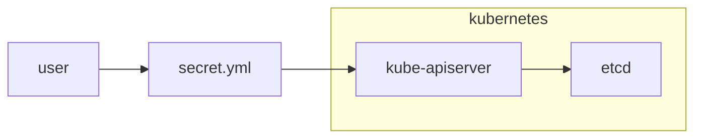
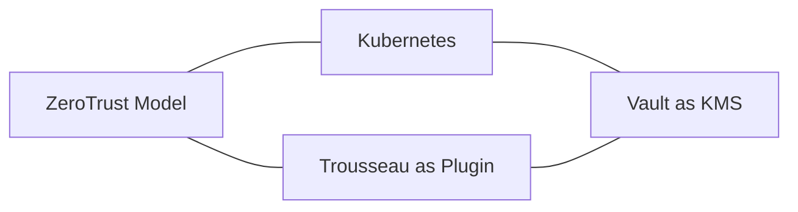
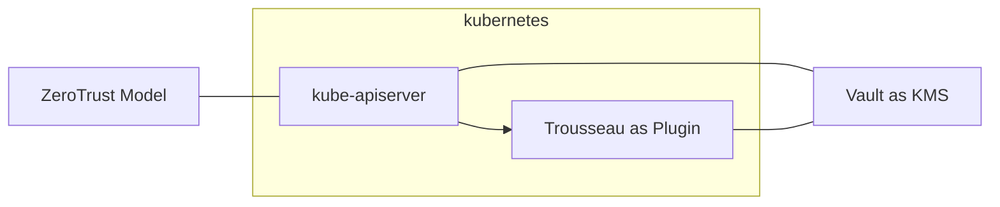
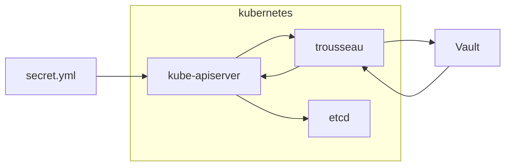
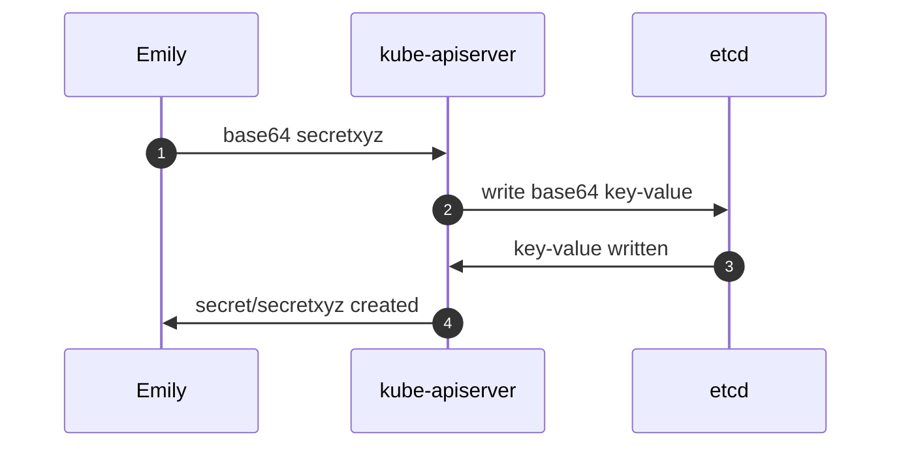
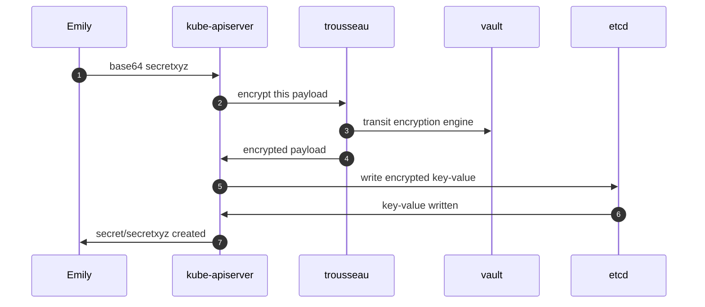

| Type  | Event | Date | Location |
|-------|-------|------|----------|
| in-person conference | [HashiConf Europe](https://www.meetup.com/london-hashicorp-user-group/events/285864430/) | 22/06/2022 | Westerliefde in Amsterdam |

## Abstract
Kubernetes is dominating cloud native application deployment along with the re-platforming and refactoring of legacy applications with the support of HashiCorp Vault. 
However, critical low level Kubernetes components like CNI, CSI, Operators are not capable or design to benefits from the power of HashiCorp Vault.   
The usage of Kubernetes KMS provider plugin solves these challenges by leveraging HahiCorp Vault as the One to rule them all enforcing a ZeroTrust security model.

## Content
<!-- 

 -->
